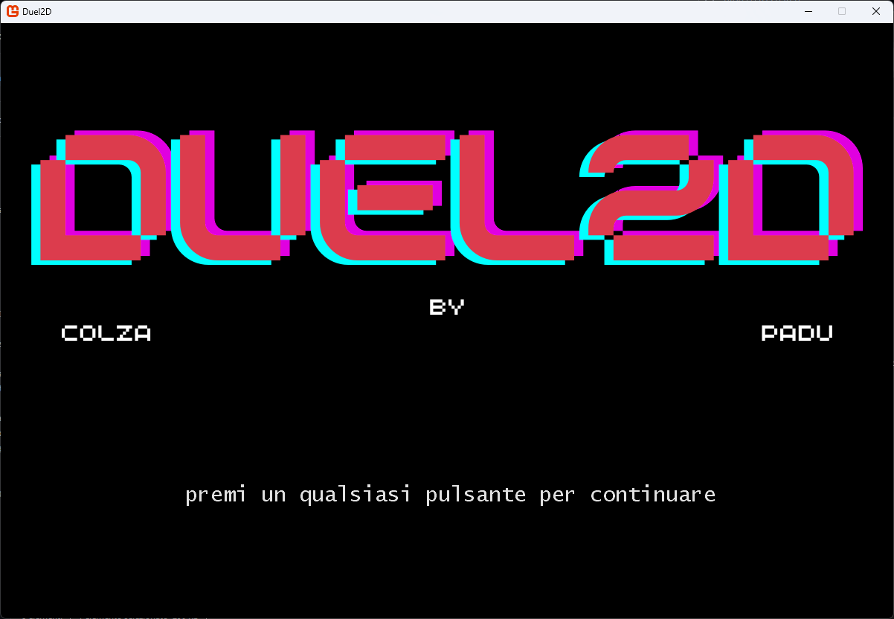
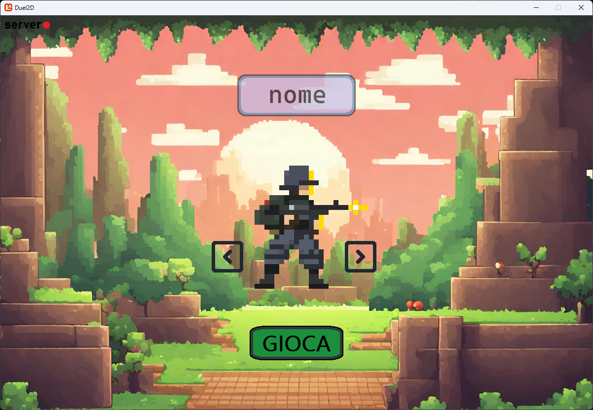
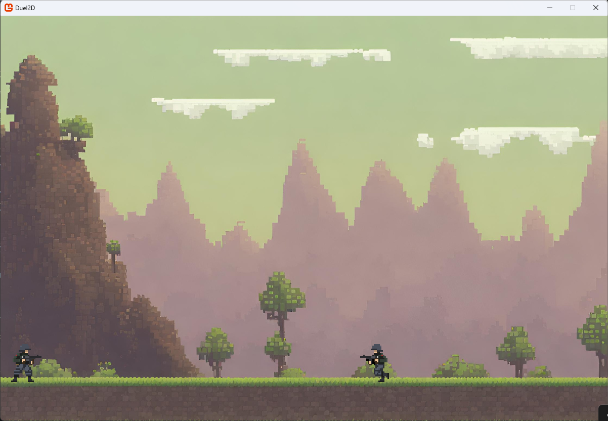

# Repository del progetto Duel2d di Padula e Colzani

## Struttura directory

- Client : contiene il client in C# (monogame)
- Server : contiene il server in Java
- Docs : contiene UML e PowerPoint

## Installazione
per installare il progetto:
```bash
git clone https://github.com/Padu360/Duel2D
```
- è necessario avere java per eseguire il server
- si può eseguire il gioco tramite il file .exe, oppure è possibile modificarlo tramite VS 2022 o altri IDE di fiducia che permettono il coding di C#
- non sarà necessario scaricare la libreria monogame per eseguire il gioco in quanto è già inclusa nel progetto
- non sarà nemmeno necessario scaricare altre librerie per eseguire il gioco o il server

## Come funziona la comunicazione client-server?
per renderlo più comprensibile a tutti ecco il sequence diagram UML di come avviene la comunicazione:


## Le schermate del nostro gioco!
-  schermata d'avvio del gioco
-  schermata di menu, con selezione nome e skin
-  schermata di caricamento in attesa di giocatori
-  schermata del gioco durante la battaglia
